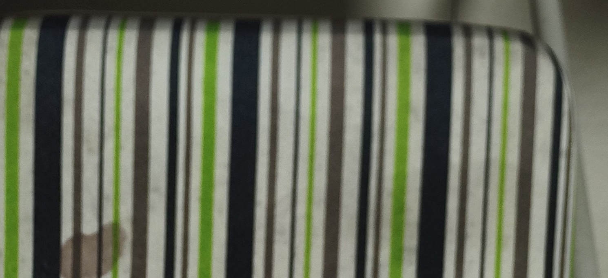

<table border=1 style='margin: auto; word-wrap: break-word;'><tr><td style='text-align: center; word-wrap: break-word;'>轮次</td><td style='text-align: center; word-wrap: break-word;'>场地</td><td style='text-align: center; word-wrap: break-word;'>类型</td><td style='text-align: center; word-wrap: break-word;'>对阵A</td><td style='text-align: center; word-wrap: break-word;'>比分A</td><td style='text-align: center; word-wrap: break-word;'>比分B</td><td style='text-align: center; word-wrap: break-word;'>对阵B</td></tr><tr><td style='text-align: center; word-wrap: break-word;'>1</td><td style='text-align: center; word-wrap: break-word;'>1号</td><td style='text-align: center; word-wrap: break-word;'>男双</td><td style='text-align: center; word-wrap: break-word;'>黄冬青 / 苏大哲</td><td style='text-align: center; word-wrap: break-word;'>17:11</td><td style='text-align: center; word-wrap: break-word;'>15:13</td><td style='text-align: center; word-wrap: break-word;'>罗蒙 / 张欣欣</td></tr><tr><td style='text-align: center; word-wrap: break-word;'>1</td><td style='text-align: center; word-wrap: break-word;'>2号</td><td style='text-align: center; word-wrap: break-word;'>混双</td><td style='text-align: center; word-wrap: break-word;'>陈顺星 / 谢卓珊</td><td style='text-align: center; word-wrap: break-word;'>8:15</td><td style='text-align: center; word-wrap: break-word;'>15:12</td><td style='text-align: center; word-wrap: break-word;'>王小波 / 李祺祺</td></tr><tr><td style='text-align: center; word-wrap: break-word;'>1</td><td style='text-align: center; word-wrap: break-word;'>3号</td><td style='text-align: center; word-wrap: break-word;'>男单</td><td style='text-align: center; word-wrap: break-word;'>林锋</td><td style='text-align: center; word-wrap: break-word;'>8:15</td><td style='text-align: center; word-wrap: break-word;'>15:12</td><td style='text-align: center; word-wrap: break-word;'>陈财贵</td></tr><tr><td style='text-align: center; word-wrap: break-word;'>1</td><td style='text-align: center; word-wrap: break-word;'>4号</td><td style='text-align: center; word-wrap: break-word;'>女单</td><td style='text-align: center; word-wrap: break-word;'>唐英武</td><td style='text-align: center; word-wrap: break-word;'>15:12</td><td style='text-align: center; word-wrap: break-word;'>15:14</td><td style='text-align: center; word-wrap: break-word;'>徐越</td></tr><tr><td colspan="7">本轮轮休：卢志辉、严勇文、林小连、刘继宇、程建兴、罗琴荩、王苏丹</td></tr><tr><td style='text-align: center; word-wrap: break-word;'>2</td><td style='text-align: center; word-wrap: break-word;'>1号</td><td style='text-align: center; word-wrap: break-word;'>男双</td><td style='text-align: center; word-wrap: break-word;'>陈顺星 / 王小波</td><td style='text-align: center; word-wrap: break-word;'>9:15</td><td style='text-align: center; word-wrap: break-word;'>9:15</td><td style='text-align: center; word-wrap: break-word;'>黄冬青 / 张欣欣</td></tr><tr><td style='text-align: center; word-wrap: break-word;'>2</td><td style='text-align: center; word-wrap: break-word;'>2号</td><td style='text-align: center; word-wrap: break-word;'>男双</td><td style='text-align: center; word-wrap: break-word;'>程建兴 / 林锋</td><td style='text-align: center; word-wrap: break-word;'>15:13</td><td style='text-align: center; word-wrap: break-word;'>15:13</td><td style='text-align: center; word-wrap: break-word;'>苏大哲 / 刘继宇</td></tr><tr><td style='text-align: center; word-wrap: break-word;'>2</td><td style='text-align: center; word-wrap: break-word;'>3号</td><td style='text-align: center; word-wrap: break-word;'>男双</td><td style='text-align: center; word-wrap: break-word;'>卢志辉 / 严勇文</td><td style='text-align: center; word-wrap: break-word;'>13:15</td><td style='text-align: center; word-wrap: break-word;'>10:15</td><td style='text-align: center; word-wrap: break-word;'>罗琴荩 / 王苏丹</td></tr><tr><td style='text-align: center; word-wrap: break-word;'>2</td><td style='text-align: center; word-wrap: break-word;'>4号</td><td style='text-align: center; word-wrap: break-word;'>女双</td><td style='text-align: center; word-wrap: break-word;'>唐英武 / 徐越</td><td style='text-align: center; word-wrap: break-word;'>15:7</td><td style='text-align: center; word-wrap: break-word;'>15:7</td><td style='text-align: center; word-wrap: break-word;'>林小连 / 谢卓珊</td></tr><tr><td colspan="7">本轮轮休：罗蒙、李祺祺、陈财贵；单打后休：林锋、苏大哲、徐越</td></tr><tr><td style='text-align: center; word-wrap: break-word;'>3</td><td style='text-align: center; word-wrap: break-word;'>1号</td><td style='text-align: center; word-wrap: break-word;'>混双</td><td style='text-align: center; word-wrap: break-word;'>王小波 / 滕菲</td><td style='text-align: center; word-wrap: break-word;'>6:15</td><td style='text-align: center; word-wrap: break-word;'>10:15</td><td style='text-align: center; word-wrap: break-word;'>林锋 / 李祺祺</td></tr><tr><td style='text-align: center; word-wrap: break-word;'>3</td><td style='text-align: center; word-wrap: break-word;'>2号</td><td style='text-align: center; word-wrap: break-word;'>男双</td><td style='text-align: center; word-wrap: break-word;'>严勇文 / 苏大哲</td><td style='text-align: center; word-wrap: break-word;'>7:15</td><td style='text-align: center; word-wrap: break-word;'>15:6</td><td style='text-align: center; word-wrap: break-word;'>黄冬青 / 张欣欣</td></tr><tr><td style='text-align: center; word-wrap: break-word;'>3</td><td style='text-align: center; word-wrap: break-word;'>3号</td><td style='text-align: center; word-wrap: break-word;'>男双</td><td style='text-align: center; word-wrap: break-word;'>陈财贵 / 王苏丹</td><td style='text-align: center; word-wrap: break-word;'>15:10</td><td style='text-align: center; word-wrap: break-word;'>15:8</td><td style='text-align: center; word-wrap: break-word;'>卢志辉 / 罗蒙</td></tr><tr><td style='text-align: center; word-wrap: break-word;'>3</td><td style='text-align: center; word-wrap: break-word;'>4号</td><td style='text-align: center; word-wrap: break-word;'>女双</td><td style='text-align: center; word-wrap: break-word;'>林小连 / 徐越</td><td style='text-align: center; word-wrap: break-word;'>15:10</td><td style='text-align: center; word-wrap: break-word;'>12:15</td><td style='text-align: center; word-wrap: break-word;'>唐英武 / 谢卓珊</td></tr><tr><td colspan="7">本轮轮休：刘继宇、程建兴、陈顺星、罗琴荩</td></tr><tr><td style='text-align: center; word-wrap: break-word;'>4</td><td style='text-align: center; word-wrap: break-word;'>1号</td><td style='text-align: center; word-wrap: break-word;'>男双</td><td style='text-align: center; word-wrap: break-word;'>王苏丹 / 严勇文</td><td style='text-align: center; word-wrap: break-word;'>15:7</td><td style='text-align: center; word-wrap: break-word;'>14:55</td><td style='text-align: center; word-wrap: break-word;'>卢志辉 / 罗琴荩</td></tr><tr><td style='text-align: center; word-wrap: break-word;'>4</td><td style='text-align: center; word-wrap: break-word;'>2号</td><td style='text-align: center; word-wrap: break-word;'>男双</td><td style='text-align: center; word-wrap: break-word;'>程建兴 / 黄冬青</td><td style='text-align: center; word-wrap: break-word;'>15:14</td><td style='text-align: center; word-wrap: break-word;'>13:15</td><td style='text-align: center; word-wrap: break-word;'>刘继宇 / 苏大哲</td></tr><tr><td style='text-align: center; word-wrap: break-word;'>4</td><td style='text-align: center; word-wrap: break-word;'>3号</td><td style='text-align: center; word-wrap: break-word;'>女双</td><td style='text-align: center; word-wrap: break-word;'>李祺祺 / 林小连</td><td style='text-align: center; word-wrap: break-word;'>15:9</td><td style='text-align: center; word-wrap: break-word;'>4:15</td><td style='text-align: center; word-wrap: break-word;'>滕菲 / 徐越</td></tr><tr><td style='text-align: center; word-wrap: break-word;'>4</td><td style='text-align: center; word-wrap: break-word;'>4号</td><td style='text-align: center; word-wrap: break-word;'>男双</td><td style='text-align: center; word-wrap: break-word;'>陈顺星 / 陈财贵</td><td style='text-align: center; word-wrap: break-word;'>15:14</td><td style='text-align: center; word-wrap: break-word;'>15:10</td><td style='text-align: center; word-wrap: break-word;'>罗蒙 / 张欣欣</td></tr><tr><td colspan="7">本轮轮休：林锋、唐英武、王小波；召回后休：谢卓珊</td></tr><tr><td style='text-align: center; word-wrap: break-word;'>5</td><td style='text-align: center; word-wrap: break-word;'>1号</td><td style='text-align: center; word-wrap: break-word;'>男单</td><td style='text-align: center; word-wrap: break-word;'>苏大哲</td><td style='text-align: center; word-wrap: break-word;'>13:15</td><td style='text-align: center; word-wrap: break-word;'>12:15</td><td style='text-align: center; word-wrap: break-word;'>程建兴</td></tr><tr><td style='text-align: center; word-wrap: break-word;'>5</td><td style='text-align: center; word-wrap: break-word;'>2号</td><td style='text-align: center; word-wrap: break-word;'>混双</td><td style='text-align: center; word-wrap: break-word;'>林锋 / 唐英武</td><td style='text-align: center; word-wrap: break-word;'>15:11</td><td style='text-align: center; word-wrap: break-word;'>15:11</td><td style='text-align: center; word-wrap: break-word;'>王小波 / 滕菲</td></tr><tr><td style='text-align: center; word-wrap: break-word;'>5</td><td style='text-align: center; word-wrap: break-word;'>3号</td><td style='text-align: center; word-wrap: break-word;'>男双</td><td style='text-align: center; word-wrap: break-word;'>陈财贵 / 罗琴荩</td><td style='text-align: center; word-wrap: break-word;'>15:15</td><td style='text-align: center; word-wrap: break-word;'>15:6</td><td style='text-align: center; word-wrap: break-word;'>刘继宇 / 严勇文</td></tr><tr><td style='text-align: center; word-wrap: break-word;'>5</td><td style='text-align: center; word-wrap: break-word;'>4号</td><td style='text-align: center; word-wrap: break-word;'>男双</td><td style='text-align: center; word-wrap: break-word;'>罗蒙 / 张欣欣</td><td style='text-align: center; word-wrap: break-word;'>14:15</td><td style='text-align: center; word-wrap: break-word;'>14:15</td><td style='text-align: center; word-wrap: break-word;'>卢志辉 / 王苏丹</td></tr><tr><td colspan="7">本轮轮休：林小连、黄冬青、李祺祺、陈顺星、徐越、谢卓珊</td></tr><tr><td style='text-align: center; word-wrap: break-word;'>6</td><td style='text-align: center; word-wrap: break-word;'>1号</td><td style='text-align: center; word-wrap: break-word;'>男双</td><td style='text-align: center; word-wrap: break-word;'>陈财贵 / 罗琴荩</td><td style='text-align: center; word-wrap: break-word;'>15:7</td><td style='text-align: center; word-wrap: break-word;'>15:12</td><td style='text-align: center; word-wrap: break-word;'>王苏丹 / 王小波</td></tr><tr><td style='text-align: center; word-wrap: break-word;'>6</td><td style='text-align: center; word-wrap: break-word;'>2号</td><td style='text-align: center; word-wrap: break-word;'>男双</td><td style='text-align: center; word-wrap: break-word;'>程建兴 / 张欣欣</td><td style='text-align: center; word-wrap: break-word;'>15:9</td><td style='text-align: center; word-wrap: break-word;'>14:15</td><td style='text-align: center; word-wrap: break-word;'>苏大哲 / 严勇文</td></tr><tr><td style='text-align: center; word-wrap: break-word;'>6</td><td style='text-align: center; word-wrap: break-word;'>3号</td><td style='text-align: center; word-wrap: break-word;'>女双</td><td style='text-align: center; word-wrap: break-word;'>林小连 / 滕菲</td><td style='text-align: center; word-wrap: break-word;'>15:14</td><td style='text-align: center; word-wrap: break-word;'>15:14</td><td style='text-align: center; word-wrap: break-word;'>李祺祺 / 谢卓珊</td></tr><tr><td style='text-align: center; word-wrap: break-word;'>6</td><td style='text-align: center; word-wrap: break-word;'>4号</td><td style='text-align: center; word-wrap: break-word;'>男双</td><td style='text-align: center; word-wrap: break-word;'>陈顺星 / 刘继宇</td><td style='text-align: center; word-wrap: break-word;'>13:15</td><td style='text-align: center; word-wrap: break-word;'>12:15</td><td style='text-align: center; word-wrap: break-word;'>黄冬青 / 罗蒙</td></tr><tr><td colspan="7">本轮轮休：林锋、卢志辉、徐越；单打后休：唐英武、李祺祺</td></tr><tr><td style='text-align: center; word-wrap: break-word;'>7</td><td style='text-align: center; word-wrap: break-word;'>1号</td><td style='text-align: center; word-wrap: break-word;'>男双</td><td style='text-align: center; word-wrap: break-word;'>陈顺星 / 刘继宇</td><td style='text-align: center; word-wrap: break-word;'>10:15</td><td style='text-align: center; word-wrap: break-word;'>12:15</td><td style='text-align: center; word-wrap: break-word;'>林锋 / 严勇文</td></tr><tr><td style='text-align: center; word-wrap: break-word;'>7</td><td style='text-align: center; word-wrap: break-word;'>2号</td><td style='text-align: center; word-wrap: break-word;'>女单</td><td style='text-align: center; word-wrap: break-word;'>李祺祺</td><td style='text-align: center; word-wrap: break-word;'>15:8</td><td style='text-align: center; word-wrap: break-word;'>15:14</td><td style='text-align: center; word-wrap: break-word;'>谢卓珊</td></tr><tr><td style='text-align: center; word-wrap: break-word;'>7</td><td style='text-align: center; word-wrap: break-word;'>3号</td><td style='text-align: center; word-wrap: break-word;'>女双</td><td style='text-align: center; word-wrap: break-word;'>林小连 / 徐越</td><td style='text-align: center; word-wrap: break-word;'>11:15</td><td style='text-align: center; word-wrap: break-word;'>15:14</td><td style='text-align: center; word-wrap: break-word;'>唐英武 / 滕菲</td></tr><tr><td style='text-align: center; word-wrap: break-word;'>7</td><td style='text-align: center; word-wrap: break-word;'>4号</td><td style='text-align: center; word-wrap: break-word;'>男双</td><td style='text-align: center; word-wrap: break-word;'>程建兴 / 王小波</td><td style='text-align: center; word-wrap: break-word;'>11:15</td><td style='text-align: center; word-wrap: break-word;'>15:11</td><td style='text-align: center; word-wrap: break-word;'>卢志辉 / 罗琴荩</td></tr><tr><td colspan="7">本轮轮休：罗蒙、张欣欣、黄冬青、苏大哲、王苏丹；单打后休：陈财贵、程建兴</td></tr><tr><td style='text-align: center; word-wrap: break-word;'>8</td><td style='text-align: center; word-wrap: break-word;'>1号</td><td style='text-align: center; word-wrap: break-word;'>混双</td><td style='text-align: center; word-wrap: break-word;'>陈财贵 / 唐英武</td><td style='text-align: center; word-wrap: break-word;'>15:12</td><td style='text-align: center; word-wrap: break-word;'>12:15</td><td style='text-align: center; word-wrap: break-word;'>林锋 / 滕菲</td></tr><tr><td style='text-align: center; word-wrap: break-word;'>8</td><td style='text-align: center; word-wrap: break-word;'>2号</td><td style='text-align: center; word-wrap: break-word;'>男双</td><td style='text-align: center; word-wrap: break-word;'>陈顺星 / 罗琴荩</td><td style='text-align: center; word-wrap: break-word;'>12:15</td><td style='text-align: center; word-wrap: break-word;'>15:10</td><td style='text-align: center; word-wrap: break-word;'>程建兴 / 卢志辉</td></tr><tr><td style='text-align: center; word-wrap: break-word;'>8</td><td style='text-align: center; word-wrap: break-word;'>3号</td><td style='text-align: center; word-wrap: break-word;'>男双</td><td style='text-align: center; word-wrap: break-word;'>黄冬青 / 罗蒙</td><td style='text-align: center; word-wrap: break-word;'>15:8</td><td style='text-align: center; word-wrap: break-word;'>15:55</td><td style='text-align: center; word-wrap: break-word;'>刘继宇 / 王苏丹</td></tr><tr><td style='text-align: center; word-wrap: break-word;'>8</td><td style='text-align: center; word-wrap: break-word;'>4号</td><td style='text-align: center; word-wrap: break-word;'>女双</td><td style='text-align: center; word-wrap: break-word;'>李祺祺 / 徐越</td><td style='text-align: center; word-wrap: break-word;'>12:15</td><td style='text-align: center; word-wrap: break-word;'>15:10</td><td style='text-align: center; word-wrap: break-word;'>林小连 / 谢卓珊</td></tr></table>

